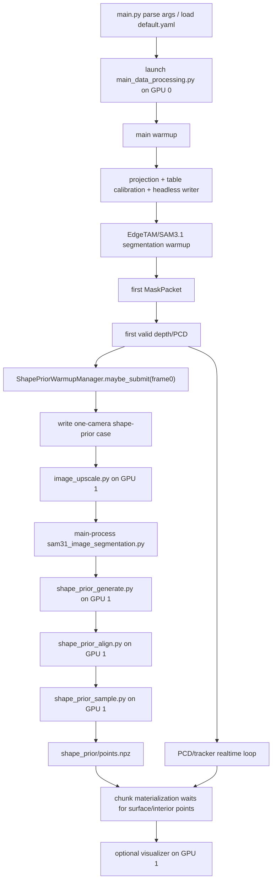

# Demo v5.1 Warmup Pipeline

本文只描述 Demo v5.1 的 warmup 阶段。主路径从 `demo_v5_1/main.py`
启动，warmup 分成两条线路：

1. **main warmup**：实时 RGB-D、mask、PCD、tracker 运行在
   `main_data_processing` 进程。
2. **Shape-prior warmup**：首个有效 object observation 触发一次 SAM3D
   shape-prior pipeline。

默认 GPU 分工固定且直接：

- `main_warmup` 和 `main_data_processing`：`CUDA_VISIBLE_DEVICES=0`
- `shape_prior_warmup` 三阶段子进程：`CUDA_VISIBLE_DEVICES=1`
- `visualizer`：`CUDA_VISIBLE_DEVICES=1`

CLI 只保留少数必要 override：

- `--main-data-processing-cuda-visible-devices`
- `--shape-prior-warmup-cuda-visible-devices`
- `--visualizer-cuda-visible-devices`
- `--shape-prior-controller-name`
- `--shape-prior-sam3d-root`
- `--shape-prior-config`

其他默认值从 `demo_v5_1/config/default.yaml` 读取。

## 总览

## Shape-Prior Boundary

`demo_v5_1/shape_prior_warmup.py` owns the shape-prior lifecycle:

- receives `ShapePriorFrame0Request`
- writes a single-camera case under the headless capture directory
- launches `utils/image_upscale.py`
- runs `sam31_image_segmentation.py` in the main process with the cached SAM3.1
  image model
- launches `shape_prior_generate.py`
- launches `shape_prior_align.py`
- launches `shape_prior_sample.py`
- returns `ShapePriorResult`

The old remote worker files are intentionally gone:

- no `demo_v5_1/shape_prior.py`
- no `demo_v5_1/shape_prior_worker.py`
- no ZMQ endpoint or managed/external worker mode

## Frame-0 Request

`main_data_processing.py` constructs `ShapePriorFrame0Request` only after one
valid same-sequence `MaskPacket + depth + PCD` exists. The request contains:

- RGB in original camera resolution
- object mask in original camera resolution
- object observation mask in original camera resolution
- controller mask in original camera resolution
- color-aligned depth
- color intrinsics
- camera-to-world transform
- table-z metadata

`ShapePriorWarmupManager.maybe_submit(frame0)` submits exactly once. The heavy
SAM3D work runs asynchronously so the camera loop continues.

## Shape-Prior Case Layout

The warmup writer creates the minimal single-camera case expected by the
shape-prior stages:

- `color/0/0.png`
- `shape/high_resolution.png`
- `shape/masked_image.png`
- `mask/mask_info_0.json`
- `mask/0/0/0.png`
- `mask/processed_masks.pkl`
- `pcd/0.npz`
- `calibrate.pkl`
- `metadata.json`
- `track_process_data.pkl`

`shape/high_resolution.png` is produced by the same x4 upscaler used by the
origin data process. `shape/masked_image.png` is then produced by Demo v5.1's
local SAM3.1 image segmenter using the origin RGBA mask semantics.

## Shape-Prior Stages

1. `utils/image_upscale.py`
   - reads `color/0/0.png` and the frame-0 object mask
   - writes `shape/high_resolution.png`

2. main-process `sam31_image_segmentation.py`
   - reads `shape/high_resolution.png`
   - uses SAM3.1 to segment the object prompt
   - writes `shape/masked_image.png`

3. `shape_prior_generate.py`
   - reads `shape/masked_image.png`
   - runs SAM3D
   - writes `shape/object.glb`

4. `shape_prior_align.py`
   - imports `demo_v5_1.shape_prior_match_pairs`
   - aligns the generated mesh to the first object observation
   - writes `shape/matching/final_mesh.glb`

5. `shape_prior_sample.py`
   - samples surface and interior points from the aligned mesh
   - keeps origin sampling semantics: `--num_surface_points=1024`,
     `volume_mesh(..., 10000)`, `--volume_sample_size=0.005`
   - writes `final_data.pkl`

The headless writer then writes `shape_prior/points.npz` with display points,
surface points, interior points, and metadata.

## Chunk Gate

`main.py` uses `stream_chunk_data_from_headless_capture()` to materialize chunks.

When shape prior is enabled:

- `require_shape_prior=True`
- chunk writer waits for `surface_points` and `interior_points`
- timeout comes from `shape_prior_chunk_wait_timeout_s`
- the warmup source frame is frame 0 of
  `online_data/chunks/chunk_000000.pkl`
- post-warmup realtime processing starts at frame 1 and continues in the same
  online chunk timeline

When shape prior is disabled:

- chunks do not wait for shape-prior points
- runtime mask/PCD/tracker outputs are unchanged

## Coordinate Rule

Runtime masks remain in original camera RGB-D resolution. The high-resolution
SAM3.1 mask is used only as alpha in `shape/masked_image.png` for SAM3D input.
That mask is not written back into runtime chunk masks.
